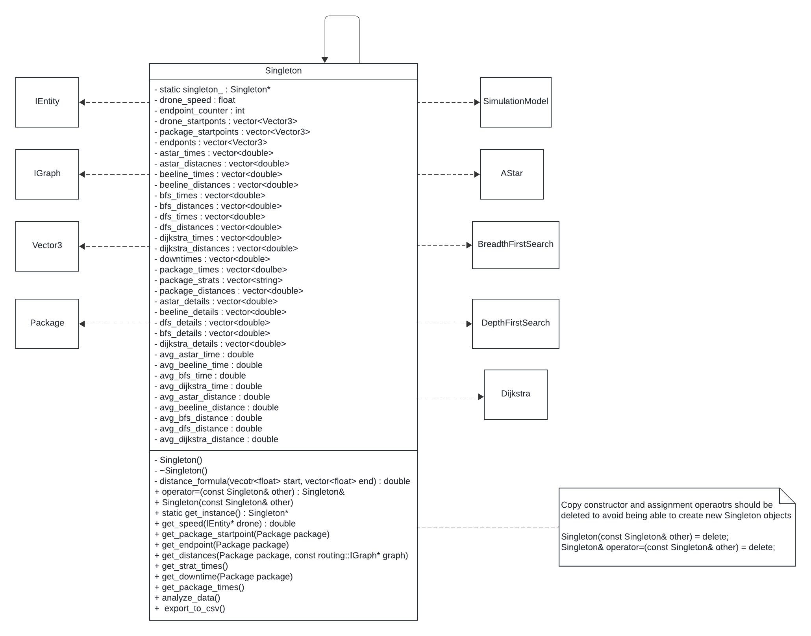

# team-010-15-hw4
## Andrew Carlson (carl6090) & Josh Subhan (subha013)
# Drone Simulation Project

## Project Overview

  This project constituted creating a drone simulation package delivery system for the University of Minnesota Twin Cities campus. There are two user interactive parts of this project. The first of which is a webpaage to view the movement of a drone picking up and delivery a package to a specified location. The second is a scheduler page where the user can choose the pickup and dropof points for the drone, and a path strategy for the drone to use for its delivery. On this scheduler page you can also view a list of all the deliveries the user has initiated. 

## How to Run

  This simulation can be ran by using the makefile in the top level of the project file structure. In the terminal type ```make``` or ```make -j``` to compile the program and then ```make run``` to start the simulation. If you are not on a local machine and using SSH then port forwarding is required to access the simulation's web interface. The specific port is set to 8081. If you are on a local machine this is not required. The simmulation page can be found at: http://127.0.0.1:8081 and the package scheduler at http://127.0.0.1:8081/schedule.html. 
  
## Simulation Details and Features

  This drone simulation handles, drone movement, package movement, and the movement of other miscellaneous entities such as humans and a helicopter. This movement is done thorugh an update function that is sclaed by a value dt. The variable dt represents the amount of time since the update function is last called. Entities such as the drone and packages are created instantiated using the factory design pattern. Each entity in the simulation has a corresponding factory class that handles all entity object instantiation. There are several methods in which a drone can deliver a package from its pickup to dropoff location. In this project we used Astar, BFS, DFS, and Dijkstra algorithms as options that the user could choose when scheduling a package. These differnet path methods would result in the drone traveling different distances and taking more or less time depending on which one was used. To implement this feature, we used the strategy design pattern. Another feature of the simulation is that depending on which path strategy was used, the drone would either spin, jump, or do both when a delivery has been completed. This was implemented using the decorator design pattern to "decorate" the drone with its respective action depending on the strategy.

## New Feature
  The newest feature of our drone simulation project is the ability to export and view statistics of the simulaiton either while it's still running or once it has been stopped. We used the singleton design pattern and created a class that would collect raw data from the simulation. We would then run analysis on the data. Both of these would be output in a csv file. The raw data that the singleton records includes pickup and dropoff location, traversal time, the path strategy that was used, the downtime experienced before being picked up, and the distance traveled. As was mentioned, the data can be output either during the simulation at the user's request, or automatically when the simulation is stopped. There is a new button on the package schedule page that allows for the outputing of the csv for the packages that have been scheduled up to that point. 

  The analyzed data derived from the information the signleton collects includes the average distance traveled and the average time for each of the path strategies. The analysis also lists the speed of each strategy, in case of future changes to the program where the drone speed becomes variable. Please note that the downtime statistic for the first package will always read 0.00 because of how we have chosen to define donwtime. The time between when a package is dropped off and the new one is picked up is what we are considering downtime. Therefore, the time between when the drone initially spawns and gets to its first package is not considered as part of this statistic. The downtime for the first package is set accordingly to reflect this.

## Sprint retrospective
  We did a total of 2 sprints, the first lasting 15 days and the second lasting 5 days. The first sprint was mainly reserved for discussion of the project, creating a plan for how to approach it, creating a UML diagram, and creating the header and cc file and providing doxygen comments. We intended to complete the implementation of the singleton into the simulation model as well in the sprint, but the other tasks ended up taking more time than expected and that task had to be dealt with in sprint 2. 
  
  Sprint 2 mostly involved testing and bugfixing the implementation of the singleton into the simulation model. Many of our issues came from conflicts between variable types during arithmatic and incorrectly referenced instances of singleton variables. Once the program itself was working, we then moved onto the final steps of linting, dockization, and presentation creation.

  A future sprint improvement would be to better take into considering the amount of time that should be alloted for specific tasks so our sprints are more equal in length. Something that went really well for us was the appropriation of the division of labor. Neither person was spending a significant amount of time on a particular task or feature.

## UML Diagram


    
